### Stack

  

I build web applications for a living and experiment with quantum algorithms when nobody is watching. Most of my time goes into typed backends, component architecture, and figuring out why the circuit that worked in the simulator does not work on real hardware.

### Currently

- Building APIs with **NestJS** and **TypeScript** — modular, tested, boring in the good way
- Writing **React** frontends that stay readable after month three
- Prototyping in **Python**, from data plumbing to **Qiskit** circuits
- Reading about error correction and pretending I understand all of it

### Stack

| | |
|---|---|
| **Languages** | TypeScript, Python |
| **Frontend** | React |
| **Backend** | NestJS, Node.js |
| **Quantum** | Qiskit |

### Contributions

  

### Reach me

 
